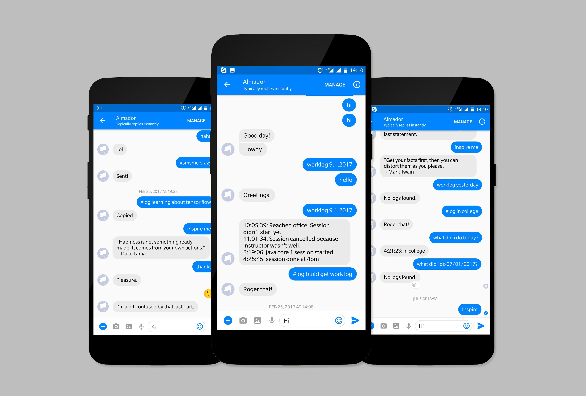

github/aravindballa/almador

This is my personal assistant. Period. It is a Facebook Messenger Bot.

I built this in node using Firebase as the storage and api.ai as the NLP engine. This is for my personal use. I basically built this to log my work, i.e. things I do on a daily basis. I can ask it to tell me what I have done on a particular day.

I do a lot of things daily. Its hard to keep track of everything. And sometimes I feel I haven’t achieved things over a week or month. The basic idea behind this is to remind me that I have done pretty good amount of work. Turned out to be my motivation. Now I think whenever I look at my log, I have to feel happy about the work that I’ve done.

Also It gets random inspirational quotes for me and can SMS my friends. It doesn't hesitate in answering simple and funny questions too.
