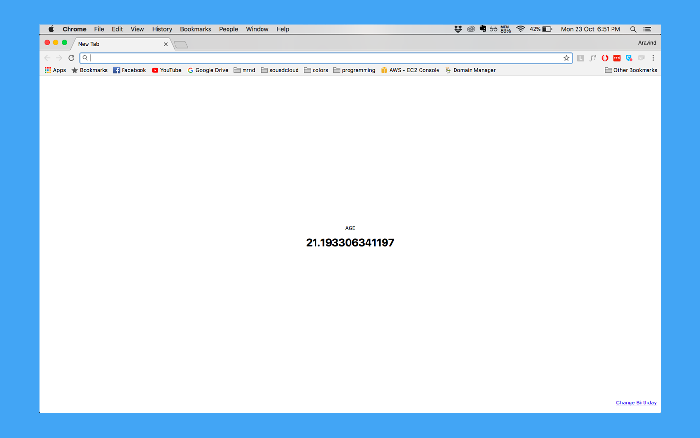

github/aravindballa/live-age-chrome

I badly wanted a reminder that time flies and to make good use of the time. I thought many ways of getting this done. Finally, ended up building a New Tab extension for chrome which displays me my live age. It keeps incrementing every second.
