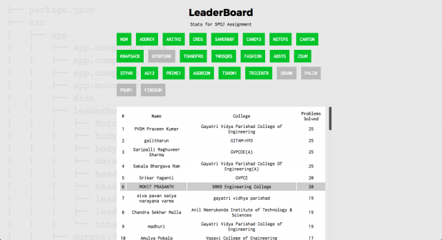

github/aravindballa/MRNDLeaderboard

In [MRND](http://missionrnd.com), the students were asked to practice competitive programming problems in SPOJ. So we wanted a tool with which we can check the progress of each student.

So I built a leaderboard using Angular and Node as the backend.

There were 25 problems for the students to solve. We wanted to know which of them were solved by a particular student. After a lot of thought, I came up with this UI, where all the problems are on the top and we have a scrollable list of students below it. When you hover on the names, the problems that the guy solved gets highlighted.
