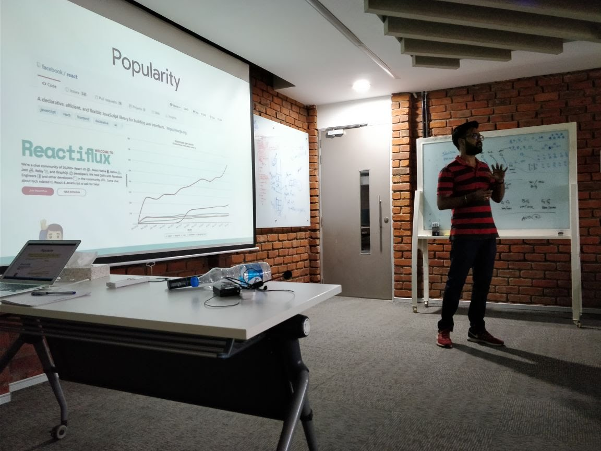

Now that I don't work from the same concrete place every time, I am really loving it. I rent a desk at a co-working space nearby and often go there. Sometimes I work from home when I have to do my daily chores, and sometimes from nearby coffee shops.

I really enjoy that I don't go to **an office** to work every day. Gone are those days when I had to sit at the same place to work (under the nose of my manager) and feel guilty to take a break or spend some time in the cafeteria.

The days earlier were daunting(in a way) and I did not have time for anything other than work. I used to work my ass off even in the weekends, sometimes. I could not function like this more than 6 months. These were the first 6 months of my day job, and I clearly knew I was getting exhausted. This was not the way to work, for me especially. It even took a toll on my productivity. Zero progress on side-projects or the things I wanted to learn or the books I wanted to read. The to-do lists just kept increasing.

> You cannot function for long without re-fueling yourselves.

I decided to change this. I took up a remote position at an awesome company. They are the best people I've ever worked with. A lot of things, including my lifestyle, have changed lately. I really enjoy the work I do, along with the life I am living.

# Things that I take benefit of

## Flexibility - time 🕰

I don't have to work at strict timings anymore. If I have some other work in the afternoon, I can shift my work timing to the night. If I don't like to work in the day, because of the noise out there, I can become a batman and work at nights.

Our team is remote. The main pro, and also a con, of a completely remote team is **availability**. But, when well managed, this is not such a problem. When you know, who will be available at what time and when to expect replies, you can adapt to the routine. I use [There app](https://there.pm) to keep track of the different time zones my colleagues are in.

## Flexibility - location 🏕

No office to go to. I go to a co working space in the city centre and work from there. I could not function alone from home for more than a month. I go to that space to have some people around. I met some amazing people there. Co-working spaces have have diverse people. From startup founders to designers to architects I've met them all. Its good to talk to them about the work they do and listen to the problems they face.

I visit my family often. I go home during some weekends and extend my stay there for few days.

I work from coffee shops if I need some change and I am getting to like it. I am planning to do it more often. I get more work done in a coffee shop. Maybe the aroma makes me more productive. 😉

(Also, I can wear anything I want.)

Travelling to other cities has been on my checklist from long ago and I will check that off soon. I plan to stay in another city for a month.

## Free time

I can now attend conferences and speak at meetups. I learned a lot by attending conferences and events. I should start writing and publishing about those experiences too.

Also, I love sharing the things I've learnt, so I speak at few meetups.

> Those who know, do. Those who understand, teach.

Not only this, I now have time for hobbies. I have been learning [German](https://www.duolingo.com/aravindballa) and I am loving it. _Vershest du Duestch?_

I read books in the evening sometimes. This year, I want to do it more. One book a month is the goal. This is the progress till now - [Goodreads](https://www.goodreads.com/user/show/35045477-aravind-balla).

I find myself pull out a notebook and practicing hand lettering sometimes. A complete beginner though.

All these things are helping me unwind after work and being in track. Productivity and the quality of work I do has improved a lot. I am learning great things at my job and it doesn't feel as overwhelming as it used to be.

# So...

I encourage you to introspect and see where is your life taking you to and where do you want to be. Change things that you are not happy with and I hope this post helps you (a little bit) in doing so.
