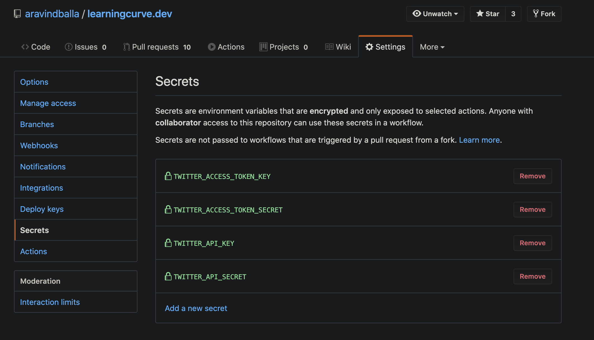

Github Actions are really powerful. I like to see them as personal assistants. You tell your assistants to do some work for you. Similarly, you tell Github actions to do some job for you.

<GrayBlock>

I've recorded a video while building this. If you'd like to watch me build, here is the video 👇

https://www.youtube.com/watch?v=XI_B99Yw4kY

</GrayBlock>

The main usecase for these actions, I feel, is when we use it to publish your library to npm or deploying your app on S3 or Github Pages whenever you push new changes. CI/CD - like the techies call it.

These actions can be triggered in different scenarios. In the above usecase, it is triggered on `push`. Similarly, you can also do it on a `pull-request` where we run a few checks or welcome new contributors to the project.

Another way to trigger an action is on a `schedule`, which is what I used to make the action Tweet everyday. 🗓We can give CRON expressions to schedule the triggers for the action.

_Okay, where do we tell all these things to the Action? There's got to be some config, right?_

Yeah. We have a `yaml` file for every action and we specify all the configuration for it there. All the yamls for your actions lie in `.github/workflows` path in your GitHub repo.

This is the action config I wrote

(Trimmed version. Full code [here](https://github.com/aravindballa/learningcurve.dev/blob/master/.github/workflows/tweet.yml))

```yml
name: Tweet

on:
  schedule:
    - cron: '0 10,16 * * *'
```

Now we know how to schedule things. Next step?

## Tweet

We know there should be an API to post tweets. But for that, you need a few API credentials from Twitter. This was a big time taking process for me as the application for a dev account on Twitter had to go through a few reviews from Twitter employees.

Once you get the credentials, tweeting is as easy as the code below.

[Full Code](https://github.com/aravindballa/learningcurve.dev/blob/master/scripts/getQuote.js)

```js
const Twitter = require('twitter');

const client = new Twitter({
  consumer_key: process.env.TWITTER_API_KEY,
  consumer_secret: process.env.TWITTER_API_SECRET,
  access_token_key: process.env.TWITTER_ACCESS_TOKEN_KEY,
  access_token_secret: process.env.TWITTER_ACCESS_TOKEN_SECRET,
});

client.post('statuses/update', { status: tweet }, function (error, tweet, response) {
  if (!error) {
    console.log(tweet);
  }
});
```

I have this in a file `scripts/getQuote.js` and I run using `yarn tweet`. We add a script in `package.json` to be able to do this.

```json
"scripts": {
  "tweet": "node  scripts/getQuote.js",
}
```

## Last step

What's remaining now is that we tell our Action to run `yarn tweet` and that's it.

```yml
jobs:
  build:
    runs-on: ubuntu-latest

    steps:
      - name: Tweet it yo
        run: |
          yarn install
          yarn tweet
        env:
          CI: true
          TWITTER_API_KEY: ${{ secrets.TWITTER_API_KEY }}
          TWITTER_API_SECRET: ${{ secrets.TWITTER_API_SECRET }}
          TWITTER_ACCESS_TOKEN_KEY: ${{ secrets.TWITTER_ACCESS_TOKEN_KEY }}
          TWITTER_ACCESS_TOKEN_SECRET: ${{ secrets.TWITTER_ACCESS_TOKEN_SECRET }}
```

If you observe, we pass the Twitter API credentials as environment variables. This can be done in the Repo settings in GitHub. You can add a few secrets and they get passed to the Actions in that repo.



That takes us to the end of the article. Thanks for reading till end and if you think learnt something from this, please tweet it so your friends learn too.

If you'd like to check out the tweets in action, its here -https://twitter.com/learningcurvpod

https://twitter.com/learningcurvpod/status/1259425283003822080

Take care.
